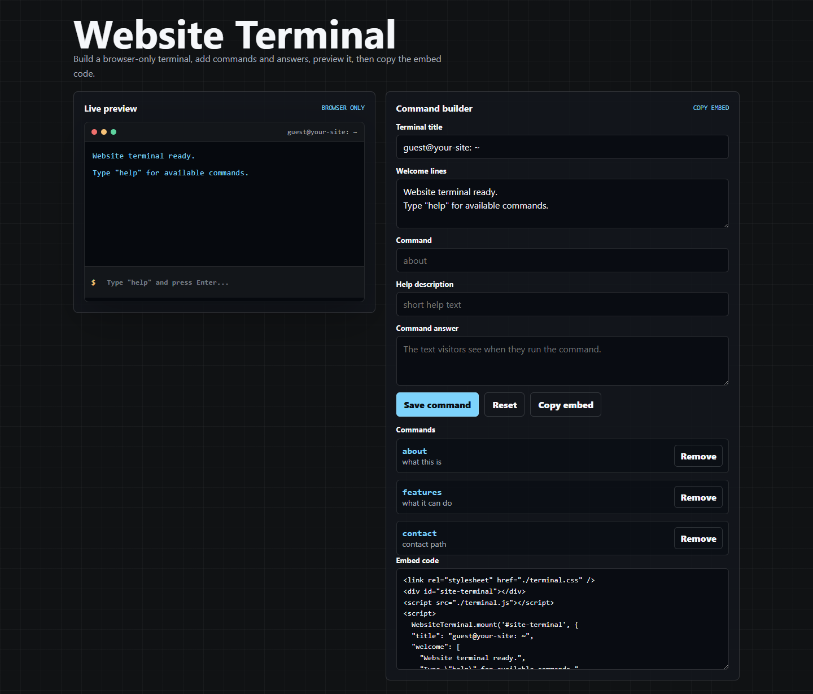

# Website Terminal

[](https://github.com/MIR4ZZZ/website-terminal/actions/workflows/checks.yml)




Add a safe, fake terminal to any normal website. Visitors type commands like `about`, `features`, or `contact`; your site prints the answers you define.

[Live builder](https://mir4zzz.github.io/website-terminal/) · [CDN example](https://mir4zzz.github.io/website-terminal/examples/cdn.html) · [Minimal example](https://mir4zzz.github.io/website-terminal/examples/minimal.html) · [Launch notes](LAUNCH.md) · [MIT license](LICENSE)

If this saves you time, star the repo so other people can find it.

## Why Use It

- Vanilla HTML, CSS, and JavaScript
- No build step
- No dependencies
- Browser-only: it never runs real shell commands
- Built-in `help` and `clear`
- Builder UI that generates the embed code for you

## Fastest Start

Open the [live builder](https://mir4zzz.github.io/website-terminal/), add your commands and answers, then copy the generated embed code.

Want the smallest possible page? Open `examples/minimal.html`. Want a no-download embed? Open `examples/cdn.html`.

The builder can generate CDN links that work anywhere, or local paths when you want to copy `terminal.css` and `terminal.js` into your project.

## Copy Into Any Site

### CDN

Paste this anywhere:

```html
<link rel="stylesheet" href="https://cdn.jsdelivr.net/gh/MIR4ZZZ/website-terminal@v1.0.1/terminal.css" />

<div id="site-terminal"></div>

<script src="https://cdn.jsdelivr.net/gh/MIR4ZZZ/website-terminal@v1.0.1/terminal.js"></script>
<script>
  WebsiteTerminal.mount('#site-terminal', {
    title: 'guest@your-site: ~',
    welcome: ['Website terminal loaded.', 'Type "help" for commands.'],
    commands: {
      about: {
        description: 'what this site is',
        text: 'Replace this with your about text.',
      },
      contact: {
        description: 'how to reach you',
        text: 'Replace this with your contact link or email.',
      },
    },
  });
</script>
```

### Local Files

Or copy these two files beside your page:

- `terminal.css`
- `terminal.js`

Add a mount point:

```html
<link rel="stylesheet" href="./terminal.css" />

<div id="site-terminal"></div>

<script src="./terminal.js"></script>
<script>
  WebsiteTerminal.mount('#site-terminal', {
    title: 'guest@your-site: ~',
    welcome: ['Website terminal loaded.', 'Type "help" for commands.'],
    commands: {
      about: {
        description: 'what this site is',
        text: 'Replace this with your about text.',
      },
      contact: {
        description: 'how to reach you',
        text: 'Replace this with your contact link or email.',
      },
    },
  });
</script>
```

## Commands

`help` and `clear` are built in. Add your own commands in the `commands` object:

```js
WebsiteTerminal.mount('#site-terminal', {
  commands: {
    docs: {
      description: 'read the docs',
      text: 'https://example.com/docs',
    },
    time: {
      description: 'browser time',
      run: () => new Date().toLocaleString(),
    },
  },
});
```

Command output is rendered with `textContent`, not `innerHTML`, so visitor input cannot inject HTML.

## Customize

Change the terminal colors with CSS variables:

```css
.website-terminal {
  --wt-bg: #05080d;
  --wt-text: #f5f7fa;
  --wt-muted: #a8b0bd;
  --wt-accent: #7dd3fc;
  --wt-prompt: #f6c177;
}
```

## Development

```bash
npm test
```

The tests check syntax, command behavior, and the builder embed generator. There is no package install step.

## Safety Model

This is a fake terminal. It only matches commands from your allowlist and prints text in the browser. Do not wire raw visitor input to a real shell.

## License

MIT
